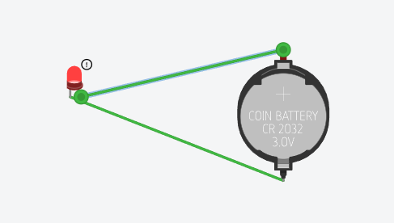
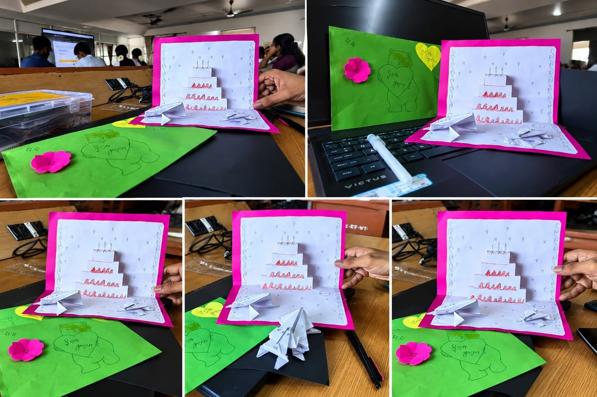

# **OHM FORCE**

## **Aim**

To design and construct an interactive, light-up conceptual greeting card ("**OHM FORCE**") utilizing a basic circuit composed of a 3V battery, LED, aluminium foil conductive traces, and decorative materials.

&nbsp;

## **Description**

The **OHM FORCE** greeting card is a playful, high-energy conceptual greeting card The primary piece is a pop-up card featuring a three-tiered cake made from white paper. The cake is detailed with red and pink hand-drawn decorations to represent icing along the edges and candles on the top tier. The card's base is white and is framed by a thick, bright pink border. The white background is embellished with small hand-drawn details, including tiny hearts, stars, and swirly decorative lines along the edges&nbsp;

&nbsp;

It is intended for celebratory occasions such as graduations, career promotions, engineering milestones, or general motivation, delivering the core message: *"**May the Force of Resistance and Resilience Be With You.**"*

&nbsp;

# **Material required**

## **Battery**

* **Voltage:** 3.0V nominal  
* **Common Dimensions:** 20 mm (diameter) x 3.2 mm (thickness) for **CR2032**  
* **Chemistry:** Lithium Manganese Dioxide (non-rechargeable)  
* **Shelf Life:** Up to 10 years when stored properly

## **LED**

* **A 3.5V LED** light operates on a forward voltage of about **2.0V** to **3.5V**&nbsp;

## **Aluminium foil**

* **Aluminium foil is** a thin, pliable sheet of processed metal used primarily for wrapping&nbsp;

## **Others**

* Color papers  
* Gum  
* Sketches  
* Tape and scissors

# **Procedure**

## **1\. Circuit Layout & Assembly**

* **Trace Preparation**: Cut strips of aluminium foil to act as conductive traces and stick them onto the card base using tape or glue.  
* **LED Placement**: Attach the 3.5V LED across the foil gaps, ensuring the positive and negative terminals correctly align with the circuit path.  
  **Power Source**: Secure the 3.0V CR2032 battery onto the circuit trace using tape or a paper flap mechanism to act as a switch.

* ## **2\. Card Design & Crafting**

* **Base Layer**: Cut and fold color papers to create the greeting card structure and cover the internal circuitry.  
* **Artwork & Detailing**: Draw the front cover "**Ohm**" (**Ω**) symbol and forcefield line art using sketches and markers.  
* **Assembly**: Use gum, tape, and scissors to assemble all decorative elements and secure the card layers together.

## **3\. Testing & Final Inspection**

* Press the switch point to test connection and ensure the LED lights up brightly through the aluminium foil circuit.  
* Inspect for any short circuits or loose tape connections before finalizing the card.

&nbsp;

# **Circuit** **
**&nbsp;

&nbsp;

# **Results**

# **Notes**

* **Paper Moisture**: Maintain relative humidity between 45%–55% in the workshop during folding to prevent spine cracking.  
* **Alternative Foils**: If gold foil is out of stock, Metallic Copper Foil (`#B87333`) is an approved secondary aesthetic match.  
* **Envelope Pairing**: Use self-seal 120 GSM recycled kraft or warm cream envelopes.

# 
